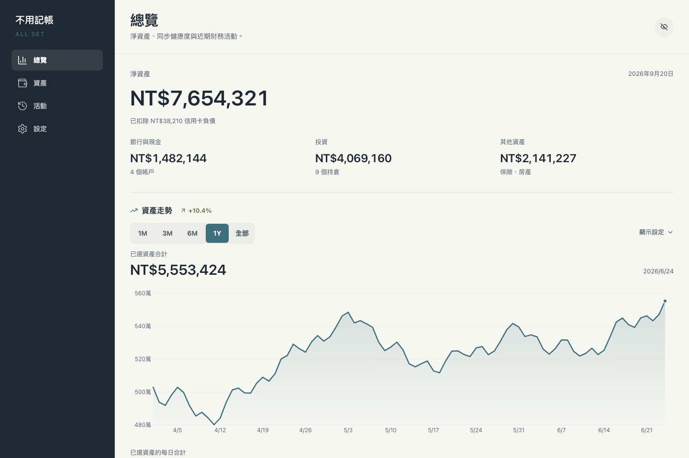
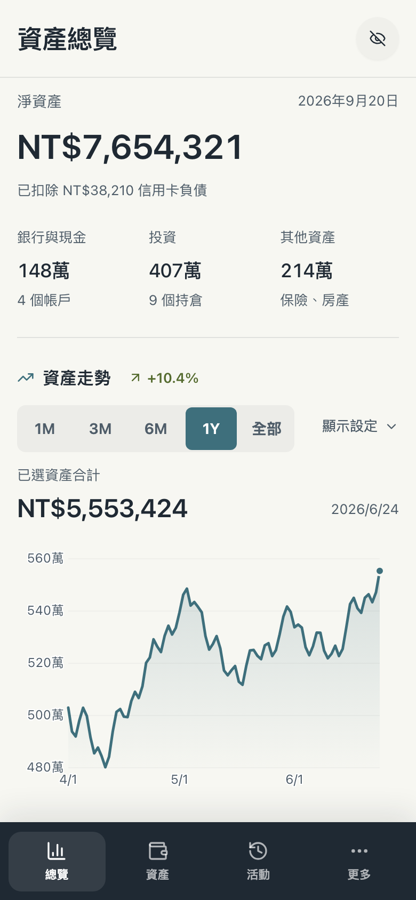
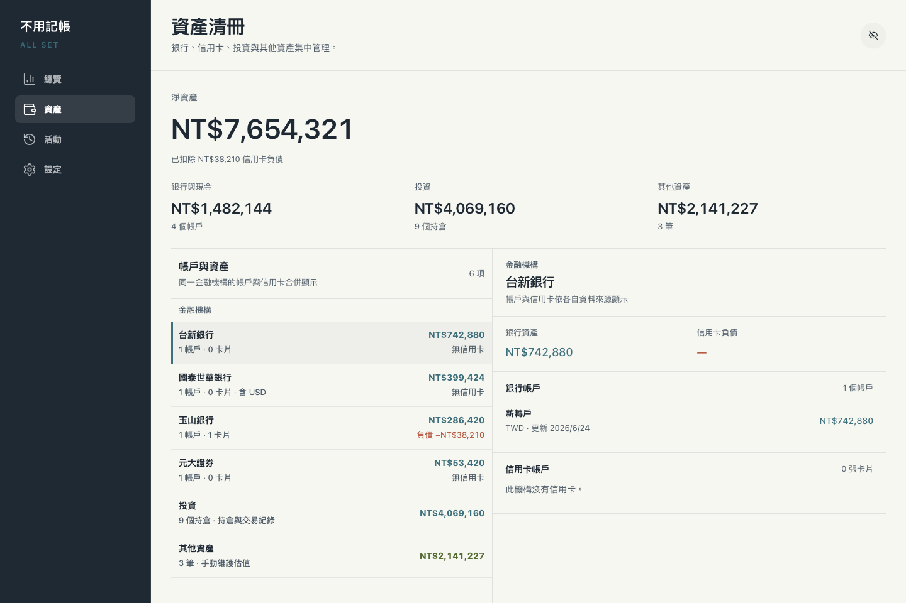
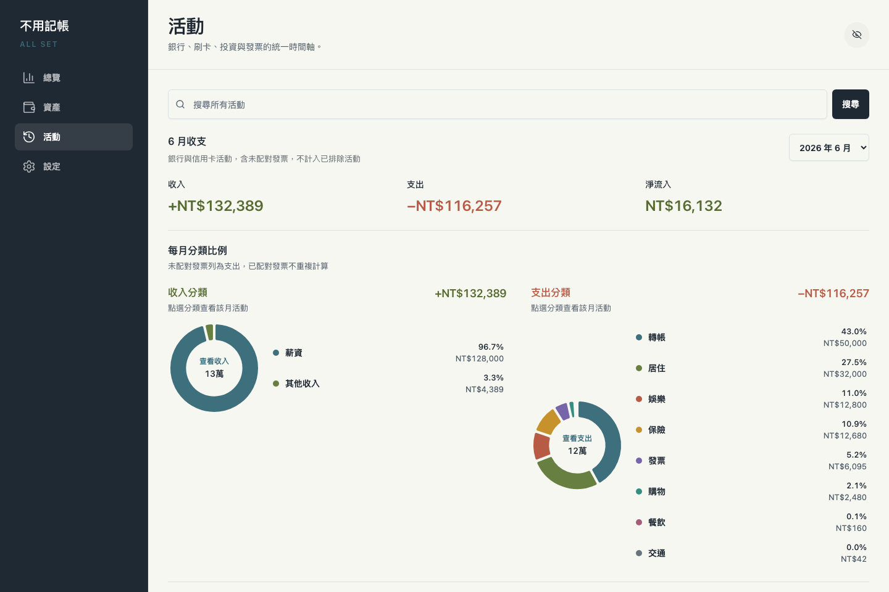
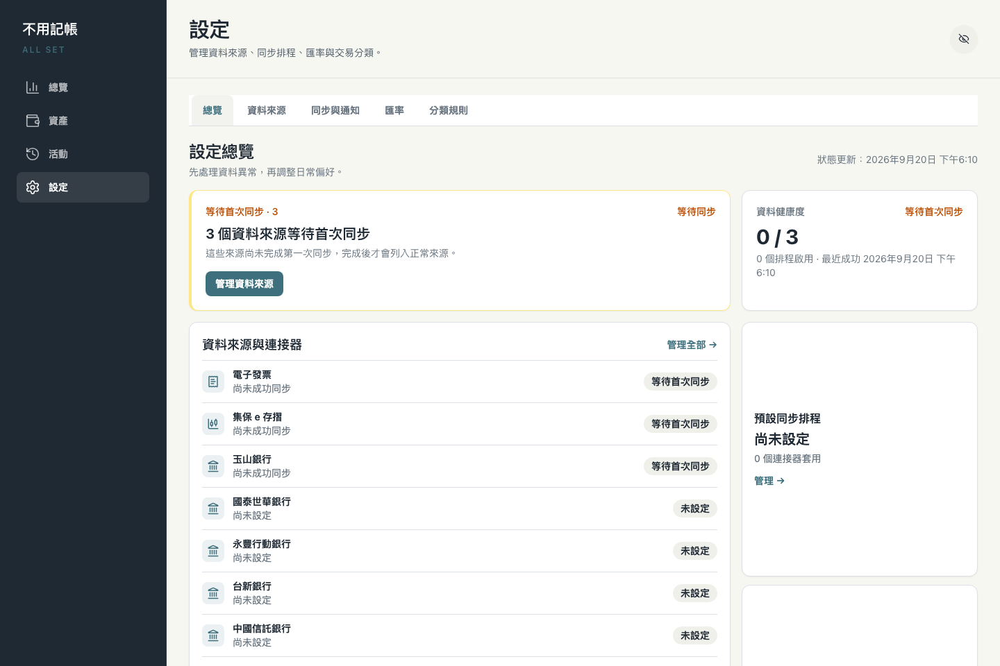

<p align="center">
  
</p>

# 不用記帳

**ALL SET — 自動同步銀行、信用卡、投資與電子發票的自架個人財務整合工具。**

**可免費自架：** 可透過 [Cloudflare Workers Free Plan](https://developers.cloudflare.com/workers/platform/pricing/) 一鍵部署，不需要自行準備伺服器；一般個人低頻使用可從免費方案開始。

## 目前介面

以下畫面使用匿名 Demo 資料，取自目前版本。

| 桌面版總覽                                                                                                                         | 手機版總覽                                                                                                                                     |
| ---------------------------------------------------------------------------------------------------------------------------------- | ---------------------------------------------------------------------------------------------------------------------------------------------- |
| <a href="images/screenshots/01-dashboard.png"></a> | <a href="images/screenshots/02-overview-mobile.png"></a> |

| 資產清冊                                                                                                       | 活動分析                                                                                                           | 設定與資料來源                                                                                                           |
| -------------------------------------------------------------------------------------------------------------- | ------------------------------------------------------------------------------------------------------------------ | ------------------------------------------------------------------------------------------------------------------------ |
| <a href="images/screenshots/03-assets.png"></a> | <a href="images/screenshots/04-activity.png"></a> | <a href="images/screenshots/05-settings.png"></a> |

## 支援資料來源

| 資料來源     | 支援內容                                                                                              | 登入與驗證                   |
| ------------ | ----------------------------------------------------------------------------------------------------- | ---------------------------- |
| 電子發票載具 | 載具發票與品項明細                                                                                    | App 登入                     |
| 集保 e 存摺  | 交割帳戶餘額與明細（[支援銀行](https://epassbook.tdcc.com.tw/zh/g1.aspx)）、股票、ETF、基金持倉與交易 | App 登入；首次可能需要 OTP   |
| 玉山銀行     | 存款帳戶、餘額與交易；信用卡帳單與刷卡交易                                                            | 網銀登入                     |
| 國泰世華銀行 | 存款帳戶、餘額與交易；信用卡帳單與刷卡交易                                                            | 網銀登入；額外驗證需人工處理 |
| 永豐行動銀行 | 信用卡總覽、近期帳單與未出帳消費                                                                      | 網銀登入；AI 自動辨識驗證碼  |
| 台新銀行     | 信用卡額度、帳單、已入帳與即時授權消費                                                                | 網銀登入；AI 自動辨識驗證碼  |
| 中國信託銀行 | 存款帳戶、餘額與交易；信用卡帳單、已入帳、未出帳與即時消費明細                                        | App 登入                     |
| 新光銀行     | 臺外幣帳戶、餘額、交易明細與信用卡帳單                                                                | App 登入                     |
| 華南銀行     | 存款帳戶與餘額；信用卡帳單與刷卡明細                                                                  | 網銀登入；AI 自動辨識驗證碼  |
| 王道銀行     | 活存、定存、餘額與交易                                                                                | App 登入；AI 自動辨識驗證碼  |
| 第一銀行     | 存款帳戶、餘額與交易明細；信用卡帳單與刷卡明細                                                        | 網銀登入；AI 自動辨識驗證碼  |
| 凱基銀行     | 臺幣活存帳戶、餘額與交易明細                                                                          | 網銀登入；AI 自動辨識驗證碼  |

## 使用限制

- 連接器依賴外部網頁、App API 與回應格式；資料來源改版後可能需要更新才能恢復同步。
- 系統不會繞過圖形驗證碼、OTP、裝置驗證等互動式安全機制；需要人工處理時會停止同步並顯示提示。
- 部分銀行自動登入可能中斷你正在使用的官方 App 或網銀工作階段。
- 資料更新時間與完整性取決於外部服務，不應視為銀行、券商或財政部的即時正式對帳資料。

## 免費部署

本專案使用的 Workers、D1、Queues、Workers AI 與 Browser Run 均提供免費額度。各項免費額度並非無限；超過服務限制時，相關功能可能暫停至額度重置。

**需要：** [Cloudflare 帳號](https://dash.cloudflare.com/signup)、[GitHub 帳號](https://github.com/signup)

### 步驟一：一鍵部署

點擊下方按鈕。Cloudflare 會在你的 GitHub 帳號建立新的 repository、自動建立 D1 Database，並部署至 Cloudflare Workers：

[](https://deploy.workers.cloudflare.com/?url=https://github.com/TedLin1993/all-set-tw)

Cloudflare Builds 會在 build 階段自動檢查並建立排程同步所需的 Queue；正式部署腳本也會再次檢查。既有安裝更新到使用 Queue 的版本時不需要手動建立資源。

首次使用時，依畫面透過 **Git account → New Github Connection → Install & Authorize** 授權 Cloudflare 存取 GitHub。

部署頁會先預填 Access 相關欄位；首次部署只需將 `CONFIG_ENCRYPTION_KEY` 改成自己產生的隨機金鑰，`TEAM_DOMAIN` 與 `POLICY_AUD` 會在步驟二設定。


`CONFIG_ENCRYPTION_KEY` 是系統加密連接器設定時必須使用的金鑰，可用下列指令產生：

```bash
openssl rand -hex 32
```

使用一鍵部署時只需填入一次，部署後由 Cloudflare 保存；日常使用與後續自動更新不需要重新輸入。沒有另外記下金鑰不會影響現有部署，但若日後要重建 Worker、搬移環境或沿用既有 D1，就必須使用相同金鑰，否則需要重新設定所有連接器。若重視災難復原，建議將它保存在密碼管理器；無論是否另外保存，都不要在既有部署中任意更換或刪除。

填寫完成後點擊 **Deploy**。

### 步驟二：啟用登入保護

1. 前往 [Cloudflare Dashboard](https://dash.cloudflare.com/) → **Workers & Pages**，選擇剛建立的 `taiwan-fin-hub`
2. 開啟 **Domains**，將 Worker URL 的存取模式從 **Public** 改為 **Restricted**
3. 若沒有 **Domains** 頁籤，請至 **Settings → Domains & Routes**，在 `workers.dev` 網址旁啟用 Cloudflare Access


切換後，Cloudflare 會顯示以下資訊：

- **Audience (aud)**：填入 Worker Secret `POLICY_AUD`
- **JWKs URL**：取出前面的網域作為 `TEAM_DOMAIN`，例如 `https://yourteam.cloudflareaccess.com`

前往 **Settings → Variables and secrets** 設定這兩個 Secret。


### 步驟三：確認部署

1. 開啟 Worker 的 `workers.dev` 網址，確認會先要求 Cloudflare Access 登入
2. 登入後前往「設定 → 資料來源」設定連接器
3. 點擊同步以取得最新資料

### 步驟四：調整登入方式與有效期限（選用）

Cloudflare Access 可能預設使用 Email OTP，登入狀態通常會在 24 小時後過期。以下設定可改用 Cloudflare 帳號登入，並將登入期限延長至一個月。

#### 使用 Cloudflare 帳號登入

1. 前往 **Zero Trust → Integrations → Identity providers**，確認已有 **Cloudflare**；若沒有，點選 **Add new identity provider → Cloudflare**
2. 啟用 **Restrict to account members** 並儲存，避免非此 Cloudflare 帳號成員登入
3. 前往 **Zero Trust → Access controls → Applications → taiwan-fin-hub → Authentication**，將登入方式設為 **Cloudflare**
4. 若只使用此登入方式，可啟用 **Apply instant authentication**，略過登入方式選擇頁

新建立的 Zero Trust organization 通常已預設啟用 Cloudflare identity provider，不需要另外新增。

#### 將登入期限延長至一個月

1. 在 `taiwan-fin-hub` Access Application 中，將 **Session Duration** 設為 **1 month**
2. 前往 **Zero Trust → Access controls → Access settings**，將 **Global session duration** 設為 **1 month**
3. 若 Access Policy 另外設定了 Session Duration，也要改為一個月，否則會以較短的期限為準

更多 Queue、Access、自動更新原理與故障排查請參考[進階部署與更新](docs/005-deployment.md)。

## 自動更新

Cloudflare 的 Deploy to Cloudflare 流程目前不會將 `.github/workflows` 複製到新 repository，因此首次部署可以正常使用，但需要完成下方的一次性設定才會啟用版本更新。

### 一次性啟用更新功能

不需要修改程式碼，可直接在 GitHub 網頁完成：

1. 在你的部署 repository 開啟 [`deploy/github/sync-upstream.yml`](deploy/github/sync-upstream.yml)，點擊 **Raw** 並複製完整內容
2. 回到 repository 首頁，選擇 **Add file → Create new file**
3. 將檔名設為 `.github/workflows/sync-upstream.yml`，貼上剛才複製的內容並 commit 至 `main`
4. 前往 **Settings → Actions → General → Workflow permissions**，確認已允許 GitHub Actions 讀寫 repository 內容

若已將 repository clone 至本機，也可以執行：

```bash
mkdir -p .github/workflows
cp deploy/github/sync-upstream.yml .github/workflows/sync-upstream.yml
git add .github/workflows/sync-upstream.yml
git commit -m "啟用版本自動更新"
git push
```

完成一次性設定後，可以前往部署 repository 的 **Actions → Sync Latest Version → Run workflow**，點擊 **Run workflow** 立即更新。workflow 也會在每天台灣時間 **04:15** 自動執行。

每次執行會取得最新版本、進行安全三方合併，並由 Cloudflare Workers Builds 重新部署。若你修改過程式碼並與上游發生衝突，workflow 會停止且不會推送；請從 Actions 紀錄查看衝突並手動處理。首次同步、備份 branch 與舊版 workflow 的排查方式請參考[進階部署與更新](docs/005-deployment.md)。

## 本機開發

建立不納入版本控制的私人設定，將 `wrangler.local.toml` 的 D1 Database ID 換成開發用資料庫，並在 `.dev.vars` 設定自己的 `CONFIG_ENCRYPTION_KEY`：

```bash
cp apps/worker/wrangler.local.toml.example apps/worker/wrangler.local.toml
cp apps/worker/.dev.vars.example apps/worker/.dev.vars
npm install
npx wrangler login
npm run dev
```

範例設定的 D1 與 Workers AI 會連到 Cloudflare remote binding，請勿使用正式資料庫。常用驗證指令：

```bash
npm run format:check
npm run typecheck
npm run verify:web
npm run test:backend
npm run build
```

本機 relay、資料庫遷移與既有 D1 部署方式請參考[進階部署與更新](docs/005-deployment.md)。

## 技術架構

前端使用 Svelte 5、TypeScript、Tailwind CSS 4 與 shadcn-svelte。

後端執行於 Cloudflare Workers，以 Hono 提供 API，並整合 D1、Access、Browser Run、Workers AI、Cron Triggers 與 Queues。

專案以 npm workspaces 管理 Web、Worker、共用型別、資料庫與連接器套件。

前後端與共用套件皆使用 TypeScript 7 型別檢查；Svelte 前端透過 `svelte-check --tsgo` 執行，並保留工具所需的 TypeScript 6 相依。

詳細設計請參考[後端架構](docs/002-backend-architecture.md)、[前端架構](docs/003-frontend-architecture.md)與[連接器開發](docs/004-connector-development.md)。

## 安全機制

- Cloudflare Access 是一般模式的登入閘道；Worker 會驗證 JWT 的簽章、issuer、audience 與有效期限。
- 連接器帳密以 `CONFIG_ENCRYPTION_KEY` 衍生的金鑰進行 AES-GCM 加密，D1 只儲存密文。
- 目前不支援金鑰輪替；若刪除或更換 Cloudflare 中的金鑰，必須重新設定所有連接器。

## 免責聲明

本程式僅供個人研究與自用，未與臺灣集中保管結算所、財政部、金融監督管理委員會、各銀行或任何金融機構合作，亦未獲前述機構授權或背書。本程式所呈現之資料以您自行提供之憑證取得，作者不保證資料之即時性、正確性與完整性，亦不對因使用本程式所產生之任何直接或間接損失負責。請勿將本程式用於任何商業用途。

## License

本專案採用 [MIT License](LICENSE)，並保留原專案的著作權與授權聲明。

> 本專案以 [kevchentw/taiwan-fin-hub](https://github.com/kevchentw/taiwan-fin-hub) 為基礎發展而來。感謝原作者與貢獻者奠定專案基礎。
