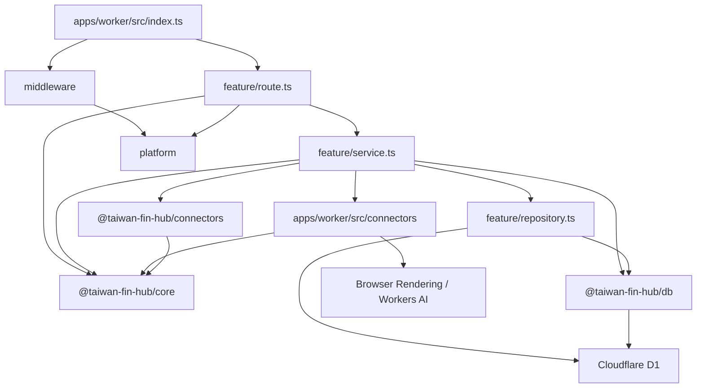
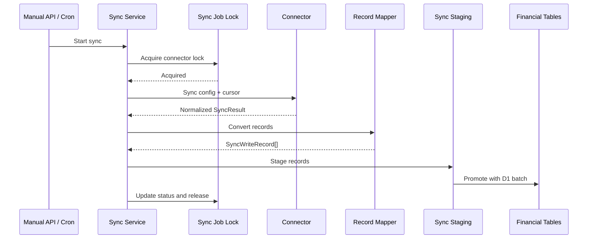

# 後端架構與維護約定

後端執行於 Cloudflare Workers，使用 Hono 提供 API，並透過 Cloudflare D1、Browser Rendering、Workers AI、Cron Triggers 與 Queues 完成資料儲存、銀行登入、驗證碼辨識及排程同步。

目前後端採用 **feature-oriented Vertical Slice Architecture**。程式依業務功能分組，而不是將所有 Controller、Service、Repository 分別集中在全域目錄。

`apps/worker/src/index.ts` 是 Composition Root，只負責：

- 建立 Hono application。
- 註冊全域 middleware。
- 組裝各 feature routes。
- 設定統一錯誤處理。
- 提供前端靜態資源。
- 接收 Cloudflare scheduled event 與 Queue message batch。

入口檔不得放置 SQL、connector 實作或具體商業流程。

## 整體結構

```text
apps/
├── web/
└── worker/
    ├── src/
    │   ├── index.ts
    │   ├── features/
    │   │   ├── activity/
    │   │   ├── bank/
    │   │   ├── classification/
    │   │   ├── connectors/
    │   │   ├── dashboard/
    │   │   ├── exchange-rates/
    │   │   ├── investments/
    │   │   ├── invoices/
    │   │   ├── manual-assets/
    │   │   ├── net-worth/
    │   │   ├── notifications/
    │   │   ├── ocr/
    │   │   └── sync/
    │   ├── connectors/
    │   ├── middleware/
    │   └── platform/
    └── tests/

packages/
├── core/
├── connectors/
└── db/
    └── migrations/
```

## 相依方向



基本原則：

- `route.ts` 不直接撰寫 SQL。
- `repository.ts` 不處理 HTTP request、status code 或 Hono `Context`。
- `service.ts` 不回傳 Hono `Response`。
- feature 不得依賴其他 feature 的 `route.ts`。
- 跨 feature 的 service 呼叫應保持明確，避免形成循環相依。
- 不為了符合形式而建立空的 Service 或 Repository。
- 不建立通用 `BaseRepository` 或過度抽象的資料存取層。

## Feature 內部結構

複雜 feature 通常採用以下結構：

```text
features/<feature>/
├── route.ts
├── service.ts
├── repository.ts
└── 其他只屬於此 feature 的檔案
```

不是每個 feature 都必須包含全部三個檔案。簡單查詢可以只有 `route.ts` 與 `service.ts`；沒有資料庫操作時不需要建立 `repository.ts`。

### `route.ts`

HTTP adapter，負責：

- 宣告 API path 與 HTTP method。
- 定義 request schema。
- 使用 Zod 驗證 body、query 與 path parameters。
- 從 Hono `Context` 取得 binding、parameter 與已驗證資料。
- 呼叫 service。
- 將預期的 service error 轉換成 HTTP status 與穩定 error code。
- 組裝 response 與 pagination headers。

不應負責：

- 直接執行 SQL。
- 實作分類、計算或同步流程。
- 處理 connector protocol。
- 執行大型資料轉換。

### `service.ts`

Use case 與商業流程層，負責：

- 組合一個完整 use case。
- 執行商業驗證與計算。
- 協調 repository、connector 與其他 service。
- 控制資料同步流程。
- 定義可預期且可由 route mapping 的 error class。
- 將 repository row 轉換成 API 所需資料。
- 管理時間、ID、加密、cursor 與同步狀態。

Service 可以直接接受 `D1Database` 或 `Env`，不需要額外建立 Dependency Injection container。

若程式只是單純資料查詢，應維持簡單，不需要套用 DDD Aggregate、Value Object 或 Command Bus。

### `repository.ts`

Feature 專用的 D1 存取層，負責：

- 集中該 feature 使用的資料存取。
- 一般 CRUD 與查詢組合預設使用 `@taiwan-fin-hub/db` 的 Drizzle schema／client。
- 執行 query、insert、update、delete 與 upsert。
- 回傳 database row、affected row count 或存在性結果。
- 在仍需原生 statement 時，建立供 service 組合的 `D1PreparedStatement`。

過渡期 repository／service 仍接受 `D1Database`，在 repository 內呼叫 `createDrizzle(binding)`，不另建 DI container，也不建立跨 request／Queue invocation 的全域 client。TypeScript property 使用 camelCase，並明確對應既有 snake_case 欄位；回傳給 service／API 的 shape 由 selection 或 mapper 維持，不把 `$inferSelect` 當成 runtime validation。

複雜 expression、CTE、條件 upsert、跨檔案組成的原生 D1 batch，或轉換後無法保留語意的路徑，可繼續使用參數化 raw SQL，並在呼叫處註明原因。同一 batch 不得混用不相容的 Drizzle query object 與 `D1PreparedStatement`。

Repository 不應：

- 接收 Hono `Context`。
- 回傳 HTTP response。
- 決定 HTTP status code。
- 呼叫外部銀行或政府 API。
- 包含與資料存取無關的商業流程。

SQL 應放在使用它的 feature 附近。只有確實被多個 feature 共用的資料存取能力，才放入 `@taiwan-fin-hub/db`。

## 共用目錄責任

### `apps/worker/src/platform/`

Cloudflare Worker 與 HTTP 平台層，目前包含：

- Worker bindings 與 Hono binding types。
- Hono factory。
- API error response。
- Demo 唯讀模式。
- Cursor pagination 工具。
- Zod validation hook。
- Cloudflare Access JWT 驗證。
- 設定與加密工具。

`platform` 不得依賴任何具體 feature。

### `apps/worker/src/middleware/`

跨 route 的 HTTP middleware：

- `accessMiddleware`：驗證 Cloudflare Access 身分；Demo 模式略過登入。
- `demoReadOnlyMiddleware`：Demo 模式只允許安全的唯讀 method。
- `connectorContextMiddleware`：驗證 connector ID，並寫入 Hono variables。

Middleware 應只處理跨功能的 request concern，不應承擔 feature 商業邏輯。

### `apps/worker/src/connectors/`

需要 Cloudflare Worker bindings 的 connector adapter，例如：

- Browser Rendering。
- Puppeteer browser lifecycle。
- Workers AI。
- Worker-specific session management。

這些 connector 可以使用 `BROWSER` 或 `AI` binding，並將外部資料轉成 `@taiwan-fin-hub/core` 定義的標準資料格式。

### `packages/connectors/`

不直接依賴 Hono、D1 或 Worker `Env` 的外部資料來源程式，包括：

- Connector config schema。
- 外部 API client。
- Protocol signing、encryption 與 parsing。
- Response normalization。
- 不需要 Worker binding 的 connector。
- 可獨立執行的 synthetic self-check。

若 connector 必須使用 Browser Rendering，通用的 config、parser 與型別仍放在此 package，Worker-specific browser adapter 則放在 `apps/worker/src/connectors/`。

### `packages/core/`

前端、Worker、database 與 connector 共用的穩定契約，包括：

- 金融資料型別。
- Connector interface。
- `ConnectorId` 與支援清單。
- Sync result。
- API success/error contract。

不得將 Hono `Context`、D1 row 或 Puppeteer object 放入 core contract。

### `packages/db/`

真正跨 feature 使用的 D1 基礎能力，目前主要包括：

- `createDrizzle(binding)`：以當次 request／Queue 的 D1 binding 包成 Drizzle client，關閉 query／parameter logging。不是連線池或 DbContext。
- `src/schema/`：依業務領域描述現有業務表；SQL migrations 仍是 schema 權威。
- Connector settings（Drizzle CRUD，保留既有 ID、建立時間與 sync cursor）。
- `sanitizeDatabaseError(error)`：在設定存取、API 與通知 log 邊界移除 Drizzle query error 的 SQL、綁定參數及 cause。
- 加密設定與 sync cursor 狀態。
- Sync job、schedule 與 lock。
- D1 migrations。

Drizzle 型別只留在 DB 與 Worker repository 層。`packages/core`、前端與 `packages/connectors` 不依賴 ORM。日期維持既有 TEXT string，金額與 JSON／flag 語意不因導入而改寫。

Feature-specific 查詢應放在 feature 的 `repository.ts`，而不是持續擴大 `packages/db/src/index.ts`。一般 repository 以 Drizzle 為預設寫法；sync job、run／item、排程、通知批次及報告的一般讀取，以及同步 lease 與獨立 run 狀態更新已使用 Drizzle。selection 維持既有 row shape、排序與 LEFT JOIN null；staging promotion 與 durable item 寫入的 statement composition 保留整組原生 D1 batch。

分類 repository 已轉換為 Drizzle；規則重排維持單一 batch，保留 NOCASE 分類唯一性、系統規則保護與 override conflict target。invoices、investments 與 bank 的一般列表／明細查詢已轉換為 Drizzle，保留游標分頁、LEFT JOIN null、pending／posted 可見性與 TEXT 日期邊界；銀行交易日條件維持可使用 `idx_bank_transactions_transaction_day`。dashboard、net-worth、activity 與 bank calculation／search 聚合已轉換為 Drizzle，保留計算值、跨來源去重、TEXT 日期與 activity search CTE；同步 lease／run 狀態更新以 Drizzle 保留單次條件 UPDATE 與 affected rows 判斷；staging promotion 保留原生 batch 的順序、計數 offset、finalize／cursor／cleanup 原子邊界。保留 SQL 的範圍與測試見下方維護約定。

資料庫 schema 與預設資料必須透過：

```text
packages/db/migrations/
```

管理，不得由 `GET` API 在執行期間自動建立，也不得對正式環境使用 `drizzle-kit push`。Schema 比對測試以 migration 重播結果為準；隔離 D1 整合測試使用 Miniflare／workerd binding，不連線正式資料庫。

### Drizzle 與原生 SQL 維護約定

一般 CRUD、篩選與 JOIN 優先使用 Drizzle；不為統一語法重寫已有測試的穩定 SQL。
複雜 CTE、window function、set-based upsert 或跨檔案組合的 D1 batch，
以可讀性與保留原子性為準，保留原生 SQL 並註明理由。

| 保留範圍                                            | 原因與主要驗證                                                                                                                                                                                                                |
| --------------------------------------------------- | ----------------------------------------------------------------------------------------------------------------------------------------------------------------------------------------------------------------------------- |
| staging JSON upsert、promotion 與 lifecycle 合併    | 保留批次參數數量、ENTITY_ORDER、count offset、cursor／finalize／cleanup 的同一 batch。`persistence.test.ts`、identity migration tests、`preference-fk-reconciliation.test.ts`、`drizzle-runtime.test.ts` 驗證資料保留及回滾。 |
| einvoice／TDCC durable item 寫入與 create-or-get    | 保留 item claim、JSON merge、計數、設定版本 CAS 及 partial unique conflict 處理。run repository 與 sync service tests 驗證重送與結案。                                                                                        |
| schedule／notification batch／report 寫入及財務 CTE | 保留固定成員快照、notification claim、報告修復及跨資產最新值／缺幣計算。notification batch、report repository 與 scheduler tests 驗證。                                                                                       |

Lease acquisition／renewal 維持單次條件 UPDATE 與 affected rows 判斷，
不得拆成 SELECT 後 UPDATE；不得用循序 await 或 Promise.all 取代原子 batch。
查詢調整須保留 expression index 的可用性，以既有 EXPLAIN QUERY PLAN 測試確認。

SQL migrations 是 schema 權威，由 Wrangler 管理套用與 migration ledger；
不導入 Drizzle Kit 生成／套用 migration 流程。現有 Kit devDependency 僅供
`packages/db/tests/schema.test.ts` 的隔離 schema 比對，不使用 push 同步資料庫。
比對須涵蓋 FK、CHECK、generated column、nullable、default、unique 與索引語意。

Drizzle repository 整合測試使用 `packages/db/testing/d1.ts` 的 Miniflare／workerd D1，
驗證回傳 shape、NULL、排序及 batch 回滾；既有 SQLite adapter 僅用於其能正確模擬的測試。
直接 import Drizzle 的 workspace 應自行宣告相依，不依賴 npm hoisting。

### 交易與發票偏好的參照完整性

`bank_transaction_preferences.transaction_id` 與
`invoice_transaction_preferences` 的 `invoice_id`／`transaction_id` 使用 FK，
刪除策略為 `NO ACTION`。合併資料須在同一 batch 先移轉或明確處理偏好，再刪除舊資料；
不得以 CASCADE 或自動清空交易 ID 抹除 linked／separate 決策。
玉山 lifecycle shadow、永豐及華南 legacy 比對共用 `transaction-merge.ts`：
僅合併雙向唯一對應且發票配對、計算偏好、分類覆寫不衝突的交易。
在同一 promotion batch 移轉偏好與交易引用後才刪除舊交易，保留決策及時間；
兩端相同的計算／分類偏好保留新版既有資料。無對應、配對歧義或偏好衝突時，
保留原交易及設定；華南亦不再直接清除沒有對應的 legacy 資料。

0045 套用前須唯讀查核以下三種孤兒引用（包含 separate 的非 NULL transaction_id）：

```sql
SELECT 'bank_transaction_preferences.transaction_id' AS reference, COUNT(*) AS orphan_count
FROM bank_transaction_preferences p
WHERE NOT EXISTS (SELECT 1 FROM bank_transactions t WHERE t.id = p.transaction_id)
UNION ALL
SELECT 'invoice_transaction_preferences.invoice_id', COUNT(*)
FROM invoice_transaction_preferences p
WHERE NOT EXISTS (SELECT 1 FROM invoices i WHERE i.id = p.invoice_id)
UNION ALL
SELECT 'invoice_transaction_preferences.transaction_id', COUNT(*)
FROM invoice_transaction_preferences p
WHERE p.transaction_id IS NOT NULL
  AND NOT EXISTS (SELECT 1 FROM bank_transactions t WHERE t.id = p.transaction_id);
```

有孤兒引用時先檢視來源與使用者決策，不自動刪除或補造父資料。
0045 以完整複製保留偏好及時間；有違規時 migration transaction 失敗回滾。
遠端套用前另確認 0044 的 NULL PK 前置條件、備份及隔離升級驗證。

### 交易自關聯

0046 為 `bank_transactions.transfer_peer_id` 與 `matched_transaction_id` 新增
指向同表 `id` 的 `NO ACTION` FK，並新增 transfer peer 索引；matched transaction
原有 partial unique index 保留。允許 NULL 與自我引用，不使用 CASCADE／SET NULL，
避免刪除父交易時改變 pending 可見性或定存計算排除。

Migration 在同一 transaction 暫存並重建兩張引用交易的 preferences 表，
保留所有交易、偏好、時間、generated column 及原有索引。孤兒引用會使升級回滾，
不自動補造父交易或清空配對。套用前備份並唯讀查核：

```sql
SELECT 'transfer_peer_id' AS reference, COUNT(*) AS orphan_count
FROM bank_transactions t
WHERE t.transfer_peer_id IS NOT NULL
  AND NOT EXISTS (SELECT 1 FROM bank_transactions p WHERE p.id = t.transfer_peer_id)
UNION ALL
SELECT 'matched_transaction_id', COUNT(*)
FROM bank_transactions t
WHERE t.matched_transaction_id IS NOT NULL
  AND NOT EXISTS (SELECT 1 FROM bank_transactions p WHERE p.id = t.matched_transaction_id);
```

一般 transaction promotion 以同一 statement 寫入交易及 transfer peer；永豐在
promotion 後更新授權配對，中信刪除副本前處理 matched reference，共用合併流程先移轉
兩種引用。未來若將相依交易拆成不同 statements，須先寫入被引用交易，
或在同一 batch 明確延後 FK 檢查並驗證回滾；同一 batch 本身不保證可任意排列。

## HTTP Request 流程

所有 API 掛載在 `/api`：

```text
Request
  → Cloudflare Access middleware
  → Demo read-only middleware
  → Connector context middleware（適用時）
  → Feature route
  → Feature service
  → Repository / Connector
  → JSON response
```

非 `/api` 路徑交由 `ASSETS` binding 提供前端靜態檔案。

## Request 驗證

外部輸入應優先使用 Zod 驗證：

```ts
api.post(
  "/example",
  zValidator(
    "json",
    requestSchema,
    validationHook("INVALID_REQUEST", "Request data is invalid."),
  ),
  async (c) => {
    const input = c.req.valid("json");
    return c.json(await executeUseCase(c.env.DB, input));
  },
);
```

約定：

- JSON body 使用 `zValidator("json", ...)`。
- Query string 使用 `zValidator("query", ...)`，或共用 pagination parser。
- 有固定集合或格式限制的 path parameter 使用 `zValidator("param", ...)`。
- 不得將未驗證的 request body 直接傳入 service 或 SQL。
- Client 不應依賴 Zod 的原始錯誤文字；API 應回傳穩定 error code。

## API 錯誤格式

API error 統一為：

```json
{
  "success": false,
  "error": {
    "code": "ERROR_CODE",
    "message": "Human-readable message."
  }
}
```

錯誤處理分為兩類：

### 預期錯誤

例如：

- Resource not found。
- Duplicate resource。
- Connector 尚未設定。
- OTP 或 CAPTCHA 需要人工處理。
- 同一 connector 已有同步工作執行中。
- 外部 connector 暫時無法使用。

Service 應使用明確的 error class 表示，route 再映射成固定 HTTP status 與 error code。

### 未預期錯誤

未被 route 處理的錯誤交由全域 `api.onError`：

- 在 Worker log 記錄完整錯誤。
- Client 固定收到 `INTERNAL_ERROR`。
- 不得回傳原始 exception、stack trace、SQL 或敏感 connector response。
- 帳號、Cookie、token、OTP 與解密後 config 不得寫入 log。

只有已知且確認不包含敏感資料的 connector 錯誤，才可將經整理的 message 回傳給 client。

## Pagination

大型且持續新增的資料列表使用 cursor-based keyset pagination：

```http
GET /api/activity?limit=50&cursor=<opaque-cursor>
```

規則：

- `limit` 預設通常為 50。
- `limit` 最大值為 100。
- `cursor` 是不透明值，前端不得解析或自行產生。
- 查詢必須使用穩定且唯一的排序欄位組合。
- 不再為新 API 增加 `offset` pagination。

回應維持既有 JSON 資料格式，並使用 headers：

```http
X-Has-More: true
X-Next-Cursor: <opaque-cursor>
```

只有 `X-Has-More` 為 `true` 時，才需要回傳 `X-Next-Cursor`。

## Connector 同步架構

同步 feature 位於：

```text
apps/worker/src/features/sync/
```

主要責任如下：

- `route.ts`：手動同步 API 與 connector-specific 錯誤 mapping。
- `service.ts`：同步 use case、設定解密、connector 呼叫、lock 與流程協調。
- `record-mapper.ts`：將 connector result 轉換成 database write record。
- `persistence.ts`：透過 staging table 與 D1 batch 將同步資料寫入正式資料表。
- `repository.ts`：同步流程使用的 query 與 prepared statement。
- `schedule-route.ts`：排程設定 API。
- `schedule-service.ts`：排程設定 use case。
- `scheduler.ts`：到期工作選取、預設排程批次與同步 dispatch。
- `scheduler-queue.ts`：Cron 啟動訊息、Queue consumer 與分段同步 continuation。
- `einvoice-sync-service.ts` / `einvoice-run-repository.ts`：電子發票 durable run 與明細工作。
- `tdcc-sync-service.ts` / `tdcc-run-repository.ts`：集保 durable run、分頁工作與結果彙整。

同步資料流：



## 同步鎖與排程

同一個 connector 的不同同步 scope 共用 canonical connector lock，避免以下工作重疊：

- 手動同步與排程同步。
- 全部同步與部分同步。
- CAPTCHA preparation 與正式同步。

目前同步 lock：

- Lease 為 30 分鐘。
- 執行期間每 5 分鐘續租。
- 一般同步工作完成或失敗後必須在 `finally` 釋放。durable run 的 connector lock 跨 invocation 維持，由成功寫入或失敗結案流程釋放；每段另有 owner-scoped run lease。
- Lock acquisition 失敗時回傳或記錄「已有同步執行中」，不得平行執行同一 connector。

Cron trigger 只負責向 `SYNC_QUEUE` 送出 scheduler 啟動訊息。Queue consumer
每次 invocation 最多處理一個 connector，完成後若確實處理了工作便以 20 秒延遲送出下一個訊息，
避免連續啟動 Browser session 時撞上 Browser Run 的 acquisition rate limit；下一次 consumer
invocation 因此不必等待下一個 10 分鐘 Cron，且擁有獨立的 Worker CPU、subrequest 與執行時間額度。
初始 Cron kick 不延遲。Queue consumer 使用 batch size 1 與 concurrency 1，維持 connector
逐一執行。是否到期仍由 D1 sync job 狀態判斷；沒有可執行工作時 consumer 不再送出訊息，
結束本次串接。

Demo 模式（`DEMO_MODE`）不執行背景同步：Cron 不送出 scheduler 啟動訊息，Queue consumer
不處理任何訊息，避免啟用 Demo 前殘留的訊息繼續以已儲存的憑證登入外部服務。scheduler 啟動訊息
直接 ack；電子發票與集保分段訊息則以 1 小時延遲重新送出以保留 continuation，關閉 Demo 後會
重新嘗試處理進行中的 durable run。若期間 session 過期或設定變更，仍可能需要重新驗證或重新啟動同步。

電子發票不在單一 connector invocation 內擷取所有品項明細。它使用
`einvoice_sync_runs` / `einvoice_sync_run_items` 作為 durable work queue：手動或排程
建立 run 後 enqueue `run-einvoice-chunk`，每個 Queue invocation 最多 claim 並取得 35
張發票明細，並以 set-based D1 寫入完成整批；仍有 pending work 時再 enqueue continuation。品項明細一律同步，並非
`public_config`、HTTP request 或 catalog 可選的 `fetchDetails` 偏好。

電子發票 run 與 item 都以 owner-scoped rolling lease 防止 Queue delivery 重送時平行處理。
只有全部 item 成功後，service 才把 durable run items 當作 staging source，以固定五個
set-based D1 statements promotion 至正式表並更新 cursor；這個 batch 以設定版本 CAS 防止
憑證更新競態。後續 finalize path 更新 `sync_jobs`、排程批次結果與通知；`promoted_at` 讓
promotion 前後的重送皆可冪等。
暫時錯誤由 Queue retry，session 失效會清除 session 後重新初始化；需要使用者操作或重試
耗盡才將 run 結案為 `needs_user_action` 或 `failed`，不寫入部分完成的明細。

### 集保分段同步

集保的手動 API 與排程由 `startTdccSyncRun` 建立／取得 active run，再 enqueue
`run-tdcc-chunk`。`tdcc_sync_runs` 保存 scope、設定版本、加密認證與 session；
`tdcc_sync_run_items` 保存銀行與投資交易的分頁工作及結果。同一 connector 的
`all`、`investments`、`bank`、`trades` 共用 active run 限制與 canonical lock。

手動啟動會先初始化登入以回報 OTP 等互動需求；排程由 Queue 初始化且不主動寄送
OTP。API 的排入同步回應不代表全部資料已完成，前端須追蹤 sync job lifecycle。
每個 chunk 取得 owner-scoped run lease、更新 connector lock，最多 claim 一個
分頁 item；仍有 pending 或 processing work 時 enqueue 下一段。item 更新使用
claim token，chunk 的 `finally` 只釋放該 owner 的 run lease。

分頁結果完成後彙整並透過 `sync_write_staging` 與 staged persistence 寫入正式表，
寫入前檢查設定版本，並在 promotion batch 更新 connector 狀態、cursor 與 sync job。
後續處理排程結果、手動報告修復與 run 結案；`promoting`、`promoted_at` 用於辨識
promotion 與 finalize 的進度。暫時錯誤使用 Queue retry，需要互動或重試耗盡時結案。

## 同步結果通知

同步結果通知位於 `apps/worker/src/features/notifications/`，不放入 sync repository。

- `route.ts`：推播設定、裝置 subscription、偏好與測試通知 API。
- `service.ts`：VAPID 設定、subscription 加密、通知派送與失效 endpoint 清理。
- `repository.ts`：`push_subscriptions` 與 `notification_preferences` 的 D1 存取。
- `payload.ts`：將 sync status 轉成不含金融明細的安全通知內容。

排程同步更新 `sync_jobs` 後才呼叫通知 service。通知是 best-effort；發送失敗只記錄 log，不得將成功同步改成失敗。瀏覽器 subscription payload 使用既有設定加密金鑰保存。

使用預設排程（`schedule_mode = inherit`）的工作採「一輪一批次」。沒有進行中的批次且至少一個繼承工作到期時，scheduler 會以單一 D1 batch transaction 建立 header，並固定快照當下所有啟用且不需使用者處理的繼承工作。批次進行期間，每次 Queue consumer invocation 只從尚未完成的固定成員中挑選一個目前未鎖定且不需使用者處理的工作；已完成的成員不會在同一輪再次執行，新啟用的工作則等下一輪。排程結果會在釋放 connector lock 前直接寫入成員，避免重複 Queue 訊息遺漏結果；停用、改為自訂排程或進入 `needs_user_action` 的非執行中成員會被略過。只有所有固定成員都有結果或被略過時，scheduler 才以條件式更新取得一次推播發送權並關閉批次，下一輪才能建立。建立新輪次時會清理超過 30 天的已結案批次。手動同步不完成或改寫進行中的批次成員；自訂排程維持逐工作推播。

手動完整同步成功後，可修復最近一筆已結案預設排程報告中同一 connector 的
`failed` 或 `needs_user_action` 來源。修復保留原排程完成時間，另記錄
`recovered_at`，並一次性累加新增筆數、更新報告的 after-snapshot。同步式手動流程
會在開始前固定可修復的批次，避免誤改執行期間才結案的新輪次；集保部分 scope
同步不修復 `all` 的批次結果。

每次 Queue scheduler invocation：

- 最多處理 1 個到期工作，讓每個 connector 使用獨立的 Worker invocation 與 subrequest 額度。
- 每個工作使用獨立 run ID。
- 成功後更新下次執行時間。
- 需要 OTP、CAPTCHA 或重新登入時記錄為 `needs_user_action`。
- 其他錯誤記錄為 `failed`。
- Log 使用結構化 JSON，包含 connector、scope、trigger、status 與 duration。

## 同步資料寫入

Connector 不得直接寫入金融資料表。

同步 service 應先：

1. 將 connector response 正規化成 core contract。
2. 使用 `record-mapper.ts` 產生 `SyncWriteRecord`。
3. 將 records 分批寫入 `sync_write_staging`。
4. 使用單一 D1 batch 將 staging records promote 至正式資料表。
5. 在同一批次執行必要的 lifecycle reconciliation、cursor 更新與 staging cleanup。

這樣可避免部分資料已更新、cursor 卻未更新，或 cursor 已更新但資料尚未完整寫入。

永豐信用卡取得 `LatestTx.Items` 與 `OutstandingDetail.Detail` 後，在 `bank_transactions`
原表保存授權，以 `matched_transaction_id` 記錄已入帳關係，不另設授權表或停用欄位。
配對僅限同卡、同消費日，不跨日；排除手續費、服務費、不同金額方向與卡片識別不足的資料。
既有相同 sourceId 優先，其次同幣別同金額，再以正規化店名相似度及目前匯率金額接近度
計分；同組採最大總分的一對一分配，無合理候選則不配對。跨幣別不要求人工確認。
已配對關係不重新分配；已入帳保留正式金額、幣別、入帳日與原始 payload，繼承授權時刻。
配對後優先沿用待入帳名稱作為 description 與 counterparty，供顯示、搜尋及規則分類；
空白或預設「永豐信用卡消費」名稱不覆蓋正式名稱。每次同步也修復既有配對，即使銀行
不再回傳該交易；同 ID 入帳沿用已保存名稱。舊版已覆蓋且來源不再提供的名稱無法復原。
在同一 D1 batch upsert 交易、保存配對、補入時刻，並於首次配對移轉原授權的個別分類、
計算偏好（已入帳既有設定優先）及發票關係。原授權與設定持續保存。
活動、搜尋、發票配對候選與收支統計僅排除 `status = 'pending'` 且
`matched_transaction_id IS NOT NULL` 的授權；同 ID 升為已入帳仍正常顯示。
不處理來源消失：未配對授權即使來源不再回傳，仍保留並顯示；空清單不刪除或隱藏資料。
缺少清單或解析失敗不寫入；無有效卡與舊版解析不執行授權配對。
已在舊版永久刪除的授權，若來源不再回傳，無法從此變更復原。

新增同步 entity 時，必須同時更新：

- `SyncEntityType`。
- Entity promotion order。
- Table、columns 與 conflict columns。
- Record mapper。
- D1 migration。
- 對應測試。

## 排程同步活動明細

總覽的「最近一次排程同步」沿用預設排程報告。展開各資料來源後才載入本次新增活動、
已入帳與補上發票的明細；一般手動同步及自訂排程沒有獨立報告。

- `sync_activity_runs` 在取得同步鎖後登記 run ID 與固定批次。手動完整同步在開始時
  固定可補救報告；只有補救 CAS 成功才發佈明細，不會混入後來完成的新批次。
- `activity-capture.ts` 與 staging promotion 共用原生 D1 batch，在寫入前辨識新增紀錄
  及既有未配對授權，於 lifecycle reconciliation 後保存已入帳關係與標準化快照。
  不以 `updated_at` 判斷內容變化；沒有變化的授權候選在同一 transaction 移除。
- 電子發票 durable promotion 使用相同 settings-version guard 保存新發票快照；
  集保使用既有 promotion 與鎖的 run ID。結果發佈與來源結果更新共用 CAS transaction。
- `activity-detail-service.ts` 在報告結案及手動補救後，以完整同日候選與既有活動配對
  規則建立展示快照。交易與發票在來源明細中合併，同批新增資料與活動筆數可不同；
  已配對授權與已入帳交易只呈現一次。跨來源列仍各自說明各來源的變動。
- 快照不含 raw payload／憑證。名稱、金額與配對展示在明細完成後不受後續同步影響。
  明細整理失敗不將成功的金融同步標成失敗；scheduler 下次 invocation 會重試未完成報告。
  投影寫入在同一 batch 檢查 materialized 狀態，較晚完成的重試不會向已凍結快照補入資料。
- `GET /api/sync-reports/:batchId/activities` 一次回傳該報告所有來源的完整明細。
  後端以各來源 `recoveredAt ?? completedAt` 固定版本，避免稍後補救混入已完成報告。
  只有完整 materialized 明細可見；舊報告回傳 legacy，尚未整理完成回傳 pending，
  不存在的報告回傳 404。報告 30 天清理會級聯清除明細。

新增資料筆數保留現有定義；此版不追蹤任意欄位修改歷史，也不新增活動頁同步排序。

## 新增一般功能

新增 feature 時：

1. 建立 `apps/worker/src/features/<feature>/`。
2. 在 `route.ts` 宣告 HTTP API 與 Zod schema。
3. 有商業流程時建立 `service.ts`。
4. 有 SQL 時建立 `repository.ts`。
5. 在 `apps/worker/src/index.ts` 註冊 feature routes。
6. Schema 有變更時新增 D1 migration。
7. 為 service、repository 或 route 的主要行為新增測試。

不要先建立抽象 interface，再尋找使用情境。只有出現實際重複或替換需求時才抽象。

## 新增 Connector

新增 connector 必須遵循 [`docs/004-connector-development.md`](004-connector-development.md)。核心步驟包括：

1. 在 `connectorCatalog` 宣告 ID、連接模式、scope、資料能力與設定欄位分類。
2. 在 `connectorConfigSchemas` 註冊 config schema、parser 與通用 protocol/client。
3. 需要 Worker binding 時，在 `apps/worker/src/connectors` 建立 adapter。
4. 在 sync service 將資料正規化並透過 staged persistence 寫入。
5. 在 `connectorRuntimeRegistry` 註冊手動／排程同步與 challenge handler。
6. 前端使用受 `ConnectorFormFieldKey` 約束的欄位，不得重複維護 connector 顯示 metadata。
7. 透過 migration 建立預設停用的 `all` sync job。
8. 完成 registry completeness、state boundary、parser、session lifecycle、route、scheduler 與 synthetic self-check。

Route 與 scheduler 應透過 runtime registry dispatch，不再新增 connector-specific switch。

Connector 回傳的 `raw` 資料只供診斷與未來 migration 使用，不得讓主要功能依賴未標準化的 raw response 結構。

## 測試與驗證

提交後端架構或 connector 變更前，至少執行：

```bash
npm run typecheck
npm run test:backend
npm run test:unit
npm run test:e2e
npm run build
```

測試責任：

- Worker feature、service 與 HTTP 行為：`@taiwan-fin-hub/worker` tests。
- 共用 D1 helpers 與 sync job：`@taiwan-fin-hub/db` tests。
- Connector protocol、parser 與 synthetic check：`@taiwan-fin-hub/connectors` self-check。
- Web component 與 client logic：Web unit tests。
- 使用者主要操作流程：Web E2E tests。

新增 connector 行為時，不得只新增無人執行的測試腳本；必須接入 `packages/connectors` 的 `test:selfcheck` 或正式 test command。

## 維護原則

- 優先讓程式靠近其業務 feature。
- Composition Root 保持精簡。
- Route 保持薄，Service 表達 use case，Repository 集中 SQL。
- 避免為小型專案引入不必要的 DDD 或 Clean Architecture ceremony。
- 只有真正跨 feature 的程式才移入 package 或 platform。
- 外部系統資料先正規化，再進入主要資料模型。
- 所有敏感設定必須加密後儲存。
- 所有未知錯誤必須在 API 邊界被消毒。
- 資料庫 schema 與預設資料只能透過 migration 管理。
- 文件與實際程式不一致時，以程式與測試為準，並在同一個變更中更新本文件。
