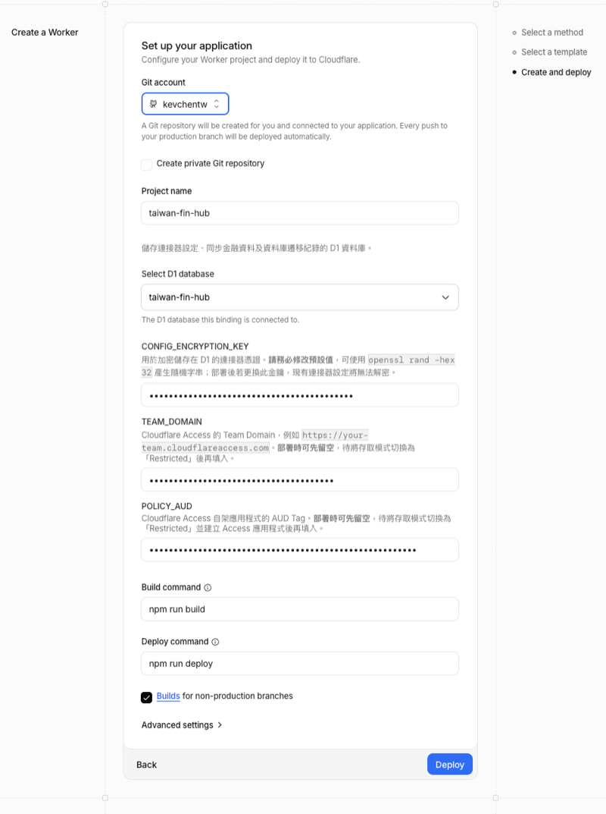
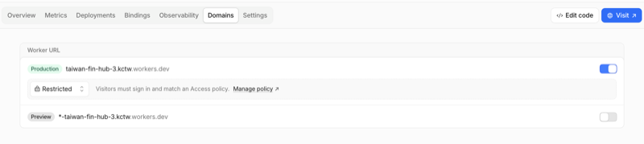
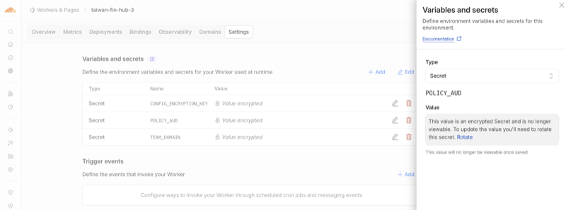

# 進階部署與更新

本文件補充 README 的部署流程，說明 Cloudflare Access、Secrets、自動更新、本機開發與既有 D1 部署。Cloudflare Dashboard 的名稱與位置可能調整；若畫面不同，請以官方文件為準。

## 部署前準備

- [Cloudflare 帳號](https://dash.cloudflare.com/signup)
- [GitHub 帳號](https://github.com/signup)
- 部署時填入的一組 `CONFIG_ENCRYPTION_KEY`

Workers、D1、Queues、Workers AI 與 Browser Run 均有免費額度，但並非無限。需要瀏覽器的連接器會共用 Browser Run 額度；Workers Free Plan 目前每日包含 10 分鐘，最新限制請參考 [Browser Run Pricing](https://developers.cloudflare.com/browser-run/pricing/)。

## 一鍵部署細節

### 1. 產生加密金鑰

```bash
openssl rand -hex 32
```

`CONFIG_ENCRYPTION_KEY` 用來加密 D1 中的連接器設定，一般私人部署仍然需要。使用一鍵部署時只需填入一次，Cloudflare 會保存並在後續部署中沿用；沒有另外記下不會影響現有 Worker。若日後要重建 Worker、搬移環境或沿用既有 D1，則必須使用相同金鑰，否則需要重新設定所有連接器。建議需要災難復原能力的使用者將它保存在密碼管理器，並且不要在既有部署中任意更換或刪除。

### 2. 執行 Deploy to Cloudflare

從 README 點擊 **Deploy to Cloudflare**，授權 Cloudflare 存取 GitHub。部署頁目前不允許欄位留空，因此 `TEAM_DOMAIN` 可先保留 `https://placeholder.invalid`，`POLICY_AUD` 與 `POLICY_AUDS` 可先保留 `temporary-placeholder`；這些只是非敏感的暫時值。接著填入 `CONFIG_ENCRYPTION_KEY` 並完成部署。啟用 Cloudflare Access 後，務必換成真正的 Team Domain 與 Audience；只有單一 Access Application 時，請刪除暫時的 `POLICY_AUDS`。在完成替換前登入驗證不會成功。



Deploy to Cloudflare 會建立部署用 repository、D1 並設定 Workers Builds。本專案的 build 與 deploy script 也會檢查排程同步所需的 `taiwan-fin-hub-sync` Queue，缺少時自動建立；部署 script 會保留既有 VAPID 金鑰，初次部署則自動產生。

若使用 Cloudflare Workers Builds 自動產生的 API token，請確認它具有帳戶層級的 **Queues Read** 與 **Queues Edit** 權限，否則 Queue 檢查或建立會失敗。

## Cloudflare Access

### 啟用登入保護

1. 前往 **Workers & Pages** 並選擇部署完成的 Worker。
2. 開啟 **Settings → Domains & Routes**。
3. 在 `workers.dev` 網址旁啟用 Cloudflare Access。

部分 Dashboard 版本會顯示 **Domains** 頁籤及 **Public／Restricted** 選項，將網址設為 **Restricted** 即可。最新操作方式請參考 [Cloudflare Access for Workers](https://developers.cloudflare.com/changelog/post/2025-10-03-one-click-access-for-workers/)。



啟用後，從 Access Application 取得：

- **Audience (aud)**：設為 Worker Secret `POLICY_AUD`。
- **JWKs URL**：取出前面的 Team Domain，設為 `TEAM_DOMAIN`，例如 `https://yourteam.cloudflareaccess.com`。

前往 Worker 的 **Settings → Variables and secrets** 儲存這兩項設定。



若同一 Worker 需要接受多個 Access Application，可設定 `POLICY_AUDS`，使用逗號或空白分隔多個 Audience。一般單一部署只需 `POLICY_AUD`，應刪除部署時暫填的 `POLICY_AUDS`。

### 使用 Cloudflare 帳號登入

Cloudflare Access 預設可能使用 Email OTP。如要限定 Cloudflare 帳號成員：

1. 前往 **Zero Trust → Integrations → Identity providers**。
2. 新增或開啟 **Cloudflare** Identity Provider，啟用 **Restrict to account members**。
3. 前往 **Access controls → Applications → taiwan-fin-hub → Authentication**，將登入方式設為 Cloudflare。
4. 若只保留此登入方式，可啟用 **Apply instant authentication**。

### 延長登入期限

登入期限會採用相關設定中最短的值。若要延長至一個月，請確認：

1. Access Application 的 **Session Duration** 為 **1 month**。
2. **Access controls → Access settings** 的 **Global session duration** 為 **1 month**。
3. Access Policy 若另有 Session Duration，也設為一個月。

## 自動更新

Deploy to Cloudflare 建立的新 repository 不會包含本專案的 `.github/workflows`，需要一次性安裝更新 workflow。

### 從 GitHub 網頁安裝

1. 在部署 repository 開啟 [`deploy/github/sync-upstream.yml`](../deploy/github/sync-upstream.yml)，點擊 **Raw** 並複製內容。
2. 回到 repository 首頁，選擇 **Add file → Create new file**。
3. 建立 `.github/workflows/sync-upstream.yml`，貼上內容並 commit 至 `main`。
4. 前往 **Settings → Actions → General → Workflow permissions**，允許 GitHub Actions 寫入 repository。

### 從本機安裝

```bash
mkdir -p .github/workflows
cp deploy/github/sync-upstream.yml .github/workflows/sync-upstream.yml
git add .github/workflows/sync-upstream.yml
git commit -m "啟用版本自動更新"
git push
```

完成後可從 **Actions → Sync Latest Version → Run workflow** 手動更新，也會在每天台灣時間 **04:15** 自動執行。

### 更新如何運作

workflow 會：

1. 取得 `TedLin1993/all-set-tw` 的最新 `main`。
2. 以前次同步版本為基準進行三方合併。
3. 保留部署 repository 自己的 `.github/workflows`。
4. 有新版本時推送至 `main`，由 Workers Builds 重新部署。

首次同步若沒有共同 Git history，更新器只會在部署內容可對應到上游版本、且 workflows 以外沒有自行修改時接軌。同步前會建立 `backup-before-first-upstream-sync` branch；同名 branch 已存在時不會覆寫。

後續同步會在 commit message 記錄上游基準，不使用 force push。若本地修改與上游衝突，更新器會在推送前停止，保留目前內容供手動處理。

### 更新故障排查

- **Workflow 沒有執行**：確認檔案位於 `.github/workflows/sync-upstream.yml`，並檢查 Actions 是否啟用。
- **無法推送更新**：確認 Workflow permissions 允許寫入 repository。
- **合併衝突**：從該次 Actions log 查看衝突檔案，手動合併後再重新執行。
- **`fatal: refusing to merge unrelated histories`**：部署 repository 仍在使用舊版 workflow，請重新複製最新的 [`deploy/github/sync-upstream.yml`](../deploy/github/sync-upstream.yml)。
- **Queue 權限錯誤**：替 Workers Builds API token 增加帳戶層級的 Queues Read 與 Queues Edit。

更新流程會保留部署 repository 目前安裝的 workflow，因此上游若修正更新流程，仍需手動替換 workflow 檔案。

## 本機開發

建立私人設定檔並填入開發用 D1 Database ID 與加密金鑰：

```bash
cp apps/worker/wrangler.local.toml.example apps/worker/wrangler.local.toml
cp apps/worker/.dev.vars.example apps/worker/.dev.vars
npm install
npx wrangler login
npm run dev
```

範例設定中的 D1 與 Workers AI 使用 remote binding，會連到 Cloudflare 資源。請使用獨立的開發 D1，不要直接操作正式資料。

常用資料庫遷移指令：

```bash
npm run db:migrate:local -w @taiwan-fin-hub/worker
npm run db:migrate:remote
```

中信行動銀行的 TLS endpoint 無法由 local workerd 直接連線，因此 `npm run dev` 會自動啟動只監聽 `127.0.0.1`、限制目的端點並使用單次隨機 token 的 Node relay；正式 Worker 不使用此 relay。

## Demo 模式

設定 `DEMO_MODE=true` 會略過 Cloudflare Access 登入、只允許唯讀 API，並停止背景排程同步，適合用來公開展示介面。

Demo 模式下任何人都能讀取該 Worker 綁定的 D1 資料，因此必須部署為獨立的 Worker，並綁定只含展示資料的 staging／demo D1；不要在儲存真實帳戶資料或連接器設定的部署啟用此模式。

## 部署至既有 D1

若要從本機部署至既有 D1，可在 repository 根目錄複製 `wrangler.toml` 為被忽略的 `wrangler.private.toml`，填入正確的 `database_id`，再執行：

```bash
XDG_CONFIG_HOME=.wrangler-config npx wrangler d1 migrations apply DB \
  --remote --config wrangler.private.toml
XDG_CONFIG_HOME=.wrangler-config node scripts/deploy-with-vapid.mjs \
  --config wrangler.private.toml
```

執行前請再次確認 `database_id`、Worker 名稱與所有 bindings 都指向預期環境。資料庫 migration 會修改遠端 schema，不要使用未確認的正式資料庫進行測試。

若既有 D1 已儲存連接器設定，部署時也必須提供原本相同的 `CONFIG_ENCRYPTION_KEY`；新的隨機金鑰無法解密既有資料。
